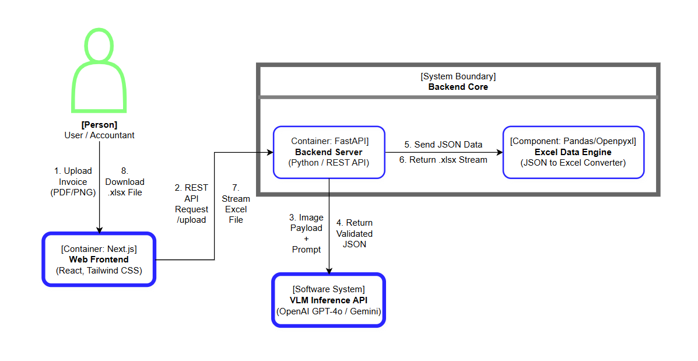

# 🏛️ SheetMind AI — System Architecture Specification

# 1. Executive Summary

**SheetMind AI** là hệ thống xử lý chứng từ thông minh (Intelligent Document Processing - IDP) ứng dụng các mô hình thị giác-ngôn ngữ (Vision-Language Models - VLM). Hệ thống tự động phân tích, trích xuất dữ liệu từ các tệp hóa đơn/chứng từ phi cấu trúc (PDF, PNG, JPG) và chuyển đổi thành dữ liệu có cấu trúc định dạng Excel (.xlsx) chuẩn nghiệp vụ kế toán.

---

# 2. System Architecture & Data Flow

## 2.1 C4 Architecture Diagram



## 2.2 Sequence Flow Detail

1. **File Ingestion:** Người dùng tải file hóa đơn lên client Next.js.
2. **Preprocessing:** Backend FastAPI tiếp nhận file, thực hiện mã hóa Base64 và chuyển đổi định dạng PDF sang chuỗi hình ảnh tối ưu dung lượng (300 DPI).
3. **VLM Inference:** Backend phát thông điệp API tới mô hình VLM kèm **Structured Prompting** yêu cầu phản hồi theo schema JSON cố định.
4. **Validation Layer:** Hệ thống tự động kiểm tra cú pháp JSON trả về, đảm bảo các trường bắt buộc (Mã số thuế, Tổng tiền) không rỗng.
5. **Excel Synthesis:** Chuyển đổi dữ liệu JSON hợp lệ thành file Excel chuẩn thông qua thư viện `pandas` / `openpyxl`.
6. **Data Delivery:** Stream kết quả file `.xlsx` về giao diện người dùng để tải xuống.

### 2.3. System Operational Scenarios (Kịch bản vận hành hệ thống)

Hệ thống được thiết kế với 5 kịch bản vận hành cốt lõi nhằm định hình trải nghiệm người dùng (UX) và luồng xử lý của Backend:

| Scenario ID | Tên kịch bản                                      | Trigger / Input (Kích hoạt)                                                        | System Behavior & Data Flow                                                                                                                                       | Expected Output (Kết quả)                                                    |
| :---------- | :------------------------------------------------ | :--------------------------------------------------------------------------------- | :---------------------------------------------------------------------------------------------------------------------------------------------------------------- | :--------------------------------------------------------------------------- |
| **OP-01**   | **Trích xuất đơn lẻ** _(Single Extraction)_       | Người dùng tải lên 1 file hóa đơn qua giao diện Web (Kéo thả/Upload).              | 1. Frontend gửi REST API request `/upload`.<br>2. Backend gọi VLM API trích xuất JSON.<br>3. Excel Engine chuyển JSON thành `.xlsx`.                              | File `.xlsx` chuẩn được sinh ra và tải xuống ngay lập tức (< 5s).            |
| **OP-02**   | **Duyệt & Sửa thủ công** _(Human-in-the-loop)_    | Trích xuất có độ tin cậy thấp (Low Confidence) hoặc người dùng chọn chế độ Review. | 1. Backend trả data JSON cho Frontend.<br>2. UI hiển thị màn hình Side-by-side (ảnh gốc & form sửa).<br>3. Người dùng sửa & xác nhận xuất Excel.                  | Dữ liệu chính xác 100% được xác nhận và xuất thành file Excel.               |
| **OP-03**   | **Xử lý hàng loạt** _(Batch Processing)_          | Người dùng tải lên danh sách nhiều file hóa đơn cùng lúc.                          | 1. Frontend gửi nhiều request/file tập trung.<br>2. Backend xử lý song song (Async/Concurrent) các gọi VLM API.<br>3. Excel Engine gộp dữ liệu thành 1 file tổng. | Màn hình hiển thị Progress bar và trả về 1 file `.xlsx` gộp toàn bộ hóa đơn. |
| **OP-04**   | **Xem & Xuất lại Lịch sử** _(History Management)_ | Người dùng truy cập Tab Lịch sử trên giao diện Web.                                | 1. Frontend gọi API danh sách lịch sử.<br>2. Backend đọc dữ liệu lịch sử phiên làm việc.<br>3. Trả về danh sách kết quả cũ.                                       | Bảng danh sách hóa đơn đã xử lý, hỗ trợ Tìm kiếm, Lọc và Tải lại file Excel. |
| **OP-05**   | **Xử lý ngoại lệ** _(Error Handling)_             | File lỗi định dạng, ảnh hỏng, hoặc API VLM bị Timeout/Sập.                         | 1. Catch error tại Backend Gateway.<br>2. Ghi log hệ thống.<br>3. Trả mã HTTP Error kèm thông điệp về Frontend.                                                   | UI hiển thị thông báo lỗi rõ ràng (Toast/Modal) kèm nút "Thử lại".           |

---

## 2.4. VLM Data Processing Strategy (Chiến lược xử lý dữ liệu AI)

Các kịch bản dưới đây định nghĩa cách hệ thống (đặc biệt là Preprocessing Pipeline và VLM) ứng phó với chất lượng tài liệu đầu vào:

| Category         | Kịch bản                               | Trigger / Input                                                  | System Behavior & Data Flow                                                                                                        | Expected Output                                                            |
| :--------------- | :------------------------------------- | :--------------------------------------------------------------- | :--------------------------------------------------------------------------------------------------------------------------------- | :------------------------------------------------------------------------- |
| **Happy Path**   | **DP-01: Standard Digital Invoice**    | Hóa đơn điện tử gốc (PDF/PNG), rõ nét, không nhiễu.              | 1. Backend đọc stream/Base64.<br>2. Direct payload tới VLM.<br>3. Validate JSON Schema.                                            | Trích xuất nhanh, chính xác 100% tất cả các trường dữ liệu.                |
| **Edge Case**    | **DP-02: Degraded / Scanned Document** | Ảnh chụp thực tế bị nghiêng, mờ nhẹ, đổ bóng hoặc thiếu sáng.    | 1. Trigger Preprocessing (Deskew, Denoise).<br>2. VLM Inference với System Prompt định hướng.<br>3. Chạy Fallback validation.      | Trích xuất thành công các trường bắt buộc (`supplier`, `total_amount`).    |
| **Complex Flow** | **DP-03: Multi-page Invoice**          | Hóa đơn dài nhiều trang hoặc bảng item bị cắt đôi qua 2 trang.   | 1. Split & Convert toàn bộ thành chuỗi ảnh Base64.<br>2. Gửi tập hợp ảnh trong cùng 1 Context Window.<br>3. Merge danh sách items. | Bảng dữ liệu Excel liên tục, không bị đứt gãy hoặc lặp header.             |
| **Edge Case**    | **DP-04: Non-Invoice Document**        | Người dùng tải nhầm file không phải hóa đơn (CV, Phong cảnh...). | 1. VLM Classification ở bước đầu.<br>2. Trả về cờ `is_invoice: false`.<br>3. Hủy bỏ pipeline trích xuất.                           | Hủy xử lý, báo lỗi "Tài liệu không hợp lệ" trên UI để tiết kiệm Token API. |

---

## 3. Technical Stack

- **Frontend:** Next.js 14+ (React Framework), TypeScript, Tailwind CSS, Lucide Icons.
- **Backend:** Python 3.11, FastAPI, Pydantic v2 (Data Validation), Uvicorn (ASGI Server), HTTPX / Requests.
- **AI Core:** OpenAI API (`gpt-4o`) / Google Gemini API (`gemini-1.5-pro`) / Local VLM (`LLaVA` via Ollama).
- **Data Processing:** Pandas, OpenPyXL (Excel Generator), PyMuPDF / pdf2image (PDF Parser & Rendering).
- **Database & Storage (Optional):** SQLite / PostgreSQL (Lưu lịch sử trích xuất), Local File System.

---

## 4. VLM Integration & JSON Schema

### 4.1 System Prompt Standard

Mọi yêu cầu gửi sang VLM phải bắt buộc thực thi chế độ **JSON Output Mode** nhằm đảm bảo tính toàn vẹn dữ liệu.

### 4.2 Target Data Schema (`invoice_schema.json`)

```json
{
  "$schema": "[http://json-schema.org/draft-07/schema#](http://json-schema.org/draft-07/schema#)",
  "type": "object",
  "properties": {
    "invoice_number": { "type": "string" },
    "invoice_date": { "type": "string", "format": "date" },
    "supplier": {
      "type": "object",
      "properties": {
        "name": { "type": "string" },
        "tax_code": { "type": "string" },
        "address": { "type": "string" }
      },
      "required": ["name", "tax_code"]
    },
    "items": {
      "type": "array",
      "items": {
        "type": "object",
        "properties": {
          "description": { "type": "string" },
          "quantity": { "type": "number" },
          "unit_price": { "type": "number" },
          "amount": { "type": "number" }
        },
        "required": ["description", "amount"]
      }
    },
    "subtotal": { "type": "number" },
    "vat_amount": { "type": "number" },
    "total_amount": { "type": "number" }
  },
  "required": ["supplier", "items", "total_amount"]
}
```
